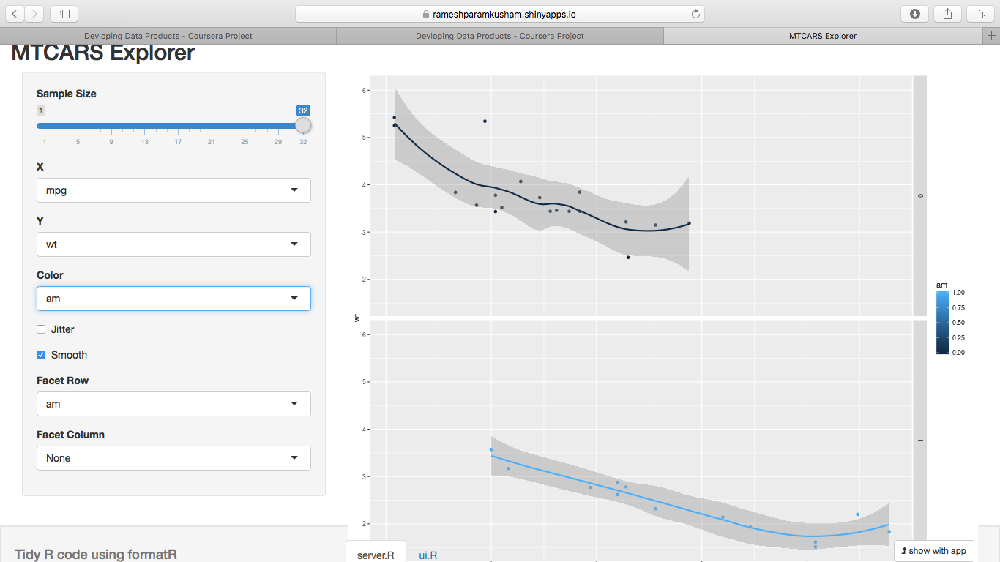

## Slide 2

## Introduction

1. This presentation is prepared for Developing Data Products Project
2. This is one of the courses for Data Science Specialization
3. It has two parts
    - Shiny app developed and deployed to Shiny portal
       - http://rameshparamkusham.shinyapps.io/shiny/
    - A reproducible pitch for the presentation on the Shiny app developed, including the source code is available on        github
       - http://rparam.github.io/dataproducts


--- .class #id 

## Slide 3

## Problem

1. Assess mpg (miles per gallon) performance of automatic and manual cars
2. Variables include: mpg cyl disp hp drat wt qsec vs am gear carb
3. The problem is to snoop the data for studying the relationship between mpg for automated, and manual transmission cars given the data for other variables
4. Ascertain the dependency of the key variables based on the dependencies


--- .class #id 


## Slide 4

1. MTCARS data set is used for this study to snoop and analyze the data.
2. The slider application developed allows the reader/user to select the predictor and response variables
3. Observe the variation for automatic and manual transmission.

For example you could see the variation of mpg with wt (weight) of the car and for both transmission types.


--- .class #id 

## Slide 5
###### Use of the Shiny app (variables can be selected) for mpg vs wt for am


```r

```


